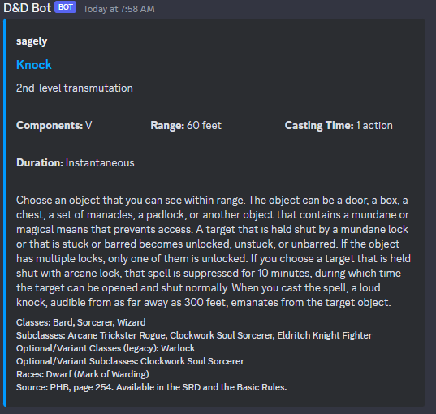

🎲 **Welcome to an innovative bot for DnD 5e**, meticulously designed with Discord.js and functioning smoothly on node.js. Equipped with four essential commands - /spell, /wspell, /item, and /witem, it's here to level up your DnD adventure.

🔮 The **/spell** command lets the bot delve into its vast spell library. It dishes out all you need to know about a spell - the mystic description, its casting range, the spell duration, and the dice rolls needed at each spell level.

🎩 But that's not all! Our bot doesn't just give out information. It's got a little bit of mind-reading magic too! It attempts to guess your typed input, presenting suggestions based on its 'intelligent' interpretation. So whether you're querying about spells or items, our bot has got you covered!

💼 Now, onto our **/item** command! Need to know about a magical artifact or a mundane piece of equipment? Just type /item followed by the name, and the bot will furnish you with all the details about that item.

🕵️ But what about keeping your strategies and discoveries secret? Well, we've got **/wspell** and **/witem** for that. These commands function identically to their counterparts, but with a twist. The information generated is ephemeral, visible only to you. This way, your quest remains as private as you'd like it to be.

🎉 With our DnD 5e bot, embark on a thrilling journey filled with assistance, precision, and privacy. Your quest just got a whole lot more fun!
